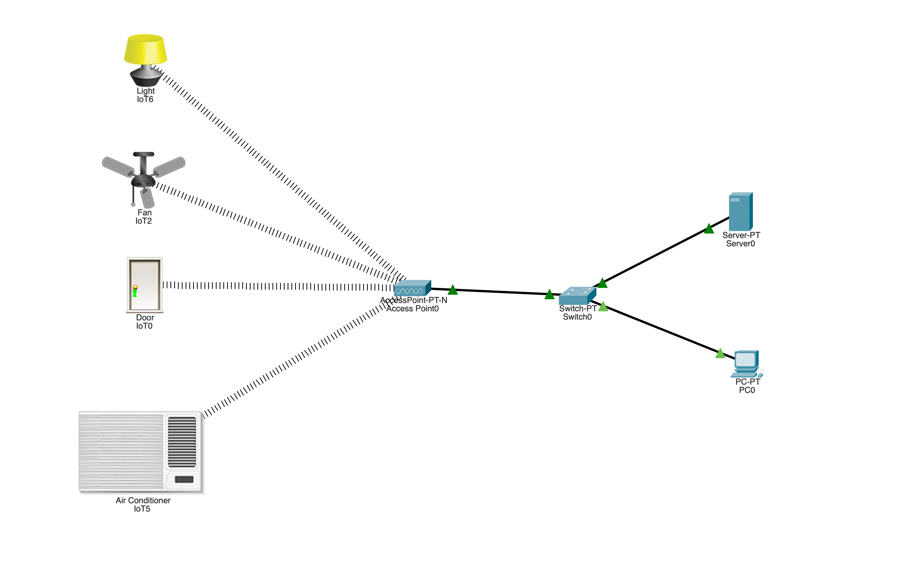
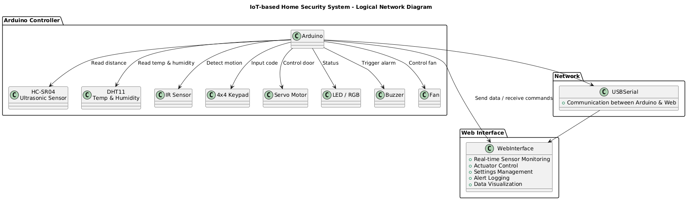

# IoT-based Home Security System

This IoT-based home security system combines 4 sensors and 4 actuators to detect motion, verify access through a keypad, and automate door control. Real-time monitoring with low-latency and remote control are provided through a web interface that displays sensor data, controls actuators, manages system settings and logs security events. Automated actions of fan cooling and door lock control, overall enhance safety and comfort. 

_Link for the web application hosted on the cloud (Works on Chrome, Edge, Opera): https://iot-security.netlify.app_

---
## Prerequisities

**Sensors (in total 4):** 
- Ultrasonic distance sensor (_HC-SR04_) 
- Temperature & Humidity sensor (_DHT11_) 
- IR sensor 
- 4×4 Membrane Keypad 

**Actuators (in total 4):** 
- Servo motor (_SG90_)
- LED 
- Buzzer (_activate_)
- Small Fan

**Sensor pins:**
- Ultrasonic (_HC-SR04_) → `TRIG`, `ECHO`
- DHT11 → digital pin
- IR sensor → digital pin
- Keypad → 8 pins (_rows & columns_)

**Atuator pins:**
- Servo → `PWM` pin
- LED → digital pin
- Buzzer → digital pin
- Fan → digital pin 

**Libraries:**
- `DHT.h` for DHT11
- `Keypad.h` for 4×4 keypad
- `Servo.h` for servo motor
- `NewPing` for Ultrasonic
- `ArduinoJson.h` for sending data

**Pin modes:**
- Sensors: `INPUT`
- Actuators: `OUTPUT`

**Default states:**
- Servo → 0° (_door closed_)
- LED → Off
- RGB → Off
- Buzzer → Off
- Fan → Off

**Communications:**
- USB serial cabel

## Main Loop

**Monitor the area using ultrasonic + IR sensors:**
- Ultrasonic distance sensor: Detects if someone is approaching.
    - If distance < “_approaching threshold_” → trigger voice/text alert:
          `"Someone is approaching the door"`
- IR sensor: Detects if someone is very close to the door.
    - If IR triggered OR ultrasonic distance < “_at-door threshold_” → trigger voice/text alert:
          `"Someone is at the door. Please enter the code on keypad"`

**Keypad input:**
- If correct code entered:
    - RGB LED → Green 
    - Servo → Rotate to “_door open_” (_simulates door opening_)
    - Voice/Text → `"Door is unlocked"`
    - Wait 3–4 seconds
    - Servo → Rotate back to 0° (_door closes_)
    - Turn RGB LED off

- If wrong code entered:
    - Buzzer → On for 1–2 seconds
    - RGB LED → Red for 1–2 seconds
    - Then turn Buzzer and RGB LED off

_No limit on number of attempts; repeat until correct code_

**Post-door-close action:**
- Monitor temperature using DHT11:
    - If temperature > threshold → Turn fan ON
    - Else → Fan OFF

**Loop continues: Monitor sensors → Door logic → Fan logic**

### Main Loop flow-diagram

## Circuit Diagram

<strong>To see where each wire and pin connects, click here:</strong>

### Components were connected in the order provided below.

**Ultrasonic Sensor (HC-SR04):**
  - VCC → 5V
  - GND → GND
  - TRIG → Pin 12
  - ECHO → Pin 11

**DHT11 Temperature Sensor:**
  - VCC → 5V (_in the middle if not defined_)
  - GND → GND (_or written as "-"_)
  - DATA → Pin 2 (_or written as "S"_)

**IR Sensor:**
  - VCC → 5V
  - GND → GND
  - OUT → Pin 3

**4×4 Keypad:**
  - Row 1 → A0
  - Row 2 → A1
  - Row 3 → A2
  - Row 4 → A3
  - Column 1 → Pin 10
  - Column 2 → A4
  - Column 3 → A5
  - Column 4 → Pin 13

**Servo Motor (SG90):**
  - Red (VCC) → 5V
  - Brown (GND) → GND
  - Orange (Signal) → Pin 9

**RGB LED (Common VCC)**
  - Common Cathode → GND
  - Red pin → Pin 5 (_with 220Ω resistor_)
  - Blue pin → Pin 7 (_with 220Ω resistor_)

**Buzzer:**
  - Positive (+) → Pin 8
  - Negative (-) → GND

**Simple Fan (2-wire with NPN Transistor):**
Required Components:
  - 1x NPN Transistor (_PN2222A_)
  - 1x 1kΩ Resistor
  - 1x Diode 1N4007 (_for protection_)
<pre>
Arduino Pin 4 → 1kΩ Resistor → Transistor Base (middle pin)
Transistor Emitter (left/right pin) → Arduino GND
Transistor Collector (left/right pin) → Fan GND (-)
Fan VCC (+) → Arduino 5V
Diode (1N4007): Cathode to Arduino 5V, Anode to Fan GND
</pre>

## Network Diagram

---
# Web Interface
---
## System Backlog 

### The web interface allows a user to:
  - Monitor all sensors in real time (_door status, temperature sensor, IR sensor_)
  - Control actuators (_door, fan, buzzer, LED_)
  - Manage system settings (_change keypad password, set ultrasonic/temperature threshold, reset settings_)
  - View sensor history, alerts, and statistics.

**Log Alerts:**
  - **Door Access:** Time of unlock, method (web or keypad).       
  - **Failed Password Attempts:** Keypad wrong entry, number of attempts.
  - **Motion Alerts:** "_Someone approaching_", "_Someone at the door_".
  - **Temperature Alerts:** “Fan ON due to high temp”.
  - **Features:** Filter by date/event type and export logs to CSV/JSON.
<pre>
| Timestamp | Event           | Source  | Extra      |
| --------- | --------------- | ------- | ---------- |
| 14:33     | Door unlocked   | Keypad  | Code: 1234 |
| 09:50     | Wrong attempt   | Keypad  | 3 tries    |
| 08:11     | Someone at door | Sensors | IR Trigger |
</pre>

**Control of actuators:**
  - **Servo (Door Lock):** Open / Close
  - **Fan:** Turn ON/OFF override
  - **RGB LED:** Choose (_Red, Blue_)
  - **Buzzer:** Turn ON/OFF (_for alarm test_)

**Password Management:**
  - Change the door unlock password (_Arduino keypad code_).
  - Require confirmation before saving.
  - Minimum 4 digits.
  - Must push new password to Arduino.

**Data Visualization:**
  - Temperature trend (_line chart, last 30 seconds_).
  - Number of door unlock attempts (_bar chart_).

**Data Analysis:**
  - Average Temperature: 23.5°C 
  - Total Visitors Today: 12
  - Failed Attempts Today: 3
  - Maximum Temperature Today: 29°C
  - Number of times Fan Activated: 5

**Device Settings:**
  - Set temperature threshold for fan.
  - Set ultrasonic thresholds (_someone approaching the door_).
  - Set a new door unlock password.
  - Reset settings to the default state.

## Folder Tree structure
<pre>
iot-security/
├──── LICENSE
├──── README.md
├──── paper/               # project's detailed description
│
├──── arduino
│    ├── arduino-webapp-controller.ino.   # main project logic
│    └── index.html                       # web interface 
│
├──── components-testing
│    ├── actuators/                        # unit testing code actuators only
│    ├── sensor-actuator-testing/          # unit testing code using both actuators and sensors
│    └── sensors/                          # unit testing code sensors only
│
└──── diagrams
     ├── circuit-diagrams/                  # circuit diagram for all individual components
     ├── network-diagrams/                  # network diagram of hardwares .pkt file
     └── uml-diagrams/                      # auxiliray system design diagrams
</pre>

## References:

<b>to see Reference List, click here:</b>

 ### Reference List:
  * Servo: https://lastminuteengineers.com/servo-motor-arduino-tutorial/
  * DHT11: https://lastminuteengineers.com/dht11-module-arduino-tutorial/
  * IR: https://lastminuteengineers.com/pir-sensor-arduino-tutorial/
  * Keypad: https://lastminuteengineers.com/arduino-keypad-tutorial/
  * Ultrasonic: https://lastminuteengineers.com/arduino-sr04-ultrasonic-sensor-tutorial/
  * ArduinoJson: https://arduinojson.org/
  * Code adapted from https://www.electronicsforu.com/electronics-projects/sensor-data-sending-over-web-serial
  * Code adapted from https://forum.arduino.cc/t/servo-motor-with-a-ultrasonic-sensor/921109
  * Code adapted from https://www.scribd.com/document/829854684/CODE-FOR-THE-PROJECT
  * Code adapted from https://yedianyang.medium.com/how-to-send-data-to-a-web-page-from-arduino-serial-port-7aef849ccdd6
  * The circuit design is adapted from https://www.youtube.com/watch?v=uwe-IMqm7GA
  * The circuit design is adapted from https://www.youtube.com/watch?v=01ycWiAeKpA
  * The circuit design is adapted from https://www.youtube.com/watch?v=qF75ZS3YjNE
  * Code adapted from https://github.com/funnierinspanish/web-serial-example
  * Code adapted from https://github.com/kjj6198/web-serial-api?tab=readme-ov-file
  * Code adapted from https://www.makerspace-online.com/controlling-microcontrollers-over-usb-with-the-web-serial-api
  * Code adapted from https://github.com/svendahlstrand/web-serial-api
  * Information learned from https://foostack.ru/web-serial-api-arduino/
  * Code adapted from https://www.youtube.com/watch?v=a8UhkWDP-dI
  * Code adapted from https://www.youtube.com/watch?v=rkiDjfTt4T0

