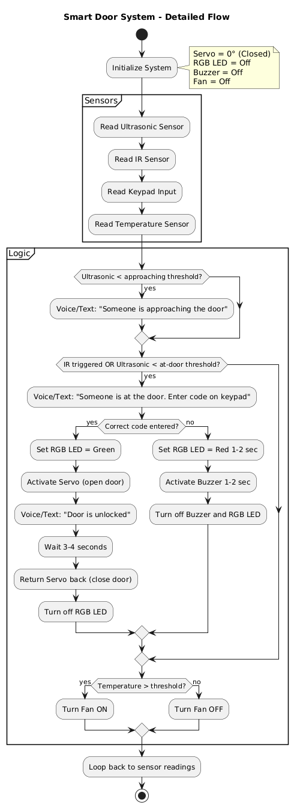

# Components Logic
---

## Prerequisities

**Sensors:** 
- Ultrasonic distance sensor (HC-SR04) 
- Temperature & Humidity sensor (DHT11) 
- IR sensor 
- 4×4 Membrane Keypad 

**Actuators:** 
- Servo motor (SG90)
- LED 
- Buzzer (activate)
- Small Fan

**Purpose:** Set up all pins, sensors, and actuators.

**Sensor pins:**
- Ultrasonic (HC-SR04) → `TRIG`, `ECHO`
- DHT11 → digital pin
- IR sensor → digital pin
- Keypad → 8 pins (rows & columns)

**Atuator pins:**
- Servo → `PWM` pin
- LED → digital pin
- Buzzer → digital pin
- Fan → digital pin 

**Libraries:**
- `DHT.h` for DHT11
- `Keypad.h` for 4×4 keypad
- `Servo.h` for servo motor
- `NewPing` for Ultrasonic

**Pin modes:**
- Sensors: `INPUT`
- Actuators: `OUTPUT`

**Default states:**
- Servo → 0° (door closed)
- LED → Off
- RGB → Off
- Buzzer → Off
- Fan → Off

## Main Loop

**Monitor the area using ultrasonic + IR sensors:**
- Ultrasonic distance sensor: Detects if someone is approaching.
    - If distance < “_approaching threshold_” → trigger voice/text alert:
          `"Someone is approaching the door"`
- IR sensor: Detects if someone is very close to the door.
    - If IR triggered OR ultrasonic distance < “_at-door threshold_” → trigger voice/text alert:
          `"Someone is at the door. Please enter the code on keypad"`

**Keypad input:**
- If correct code entered:
    - RGB LED → Green 
    - Servo → Rotate to “_door open_” (simulate door opening)
    - Voice/Text → `"Door is unlocked"`
    - Wait 3–4 seconds
    - Servo → Rotate back to 0° (door closes)
    - Turn RGB LED off

- If wrong code entered:
    - Buzzer → On for 1–2 seconds
    - RGB LED → Red for 1–2 seconds
    - Then turn Buzzer and RGB LED off

_No limit on number of attempts; repeat until correct code_

**Post-door-close action:**
- Monitor temperature using DHT11:
    - If temperature > threshold → Turn fan ON
    - Else → Fan OFF

**Loop continues: Monitor sensors → Door logic → Fan logic**

### Main Loop flow-diagram

  

  <strong>To see where each pin and wire connects, click here.</strong>
  

**Ultrasonic Sensor (HC-SR04):**
  - VCC → 5V
  - GND → GND
  - TRIG → Pin 12
  - ECHO → Pin 11

**DHT11 Temperature Sensor:**
  - VCC → 5V
  - GND → GND
  - DATA → Pin 2

**IR Sensor:**
  - VCC → 5V
  - GND → GND
  - OUT → Pin 3

**4×4 Keypad:**
  - Row 1 → A0
  - Row 2 → A1
  - Row 3 → A2
  - Row 4 → A3
  - Column 1 → Pin 10
  - Column 2 → A4
  - Column 3 → A5
  - Column 4 → Pin 13

**Servo Motor (SG90):**
  - Red (VCC) → 5V
  - Brown (GND) → GND
  - Orange (Signal) → Pin 9

**RGB LED (Common VCC)**
  - Common Cathode → GND
  - Red pin → Pin 5 (with 220Ω resistor)
  - Blue pin → Pin 7 (with 220Ω resistor)

**Buzzer:**
  - Positive (+) → Pin 8
  - Negative (-) → GND

**Simple Fan (2-wire with NPN Transistor):**
Required Components:
  - 1x NPN Transistor (2N2222, BC547, or similar)
  - 1x 1kΩ Resistor
  - 1x Diode 1N4007 (for protection)
<pre>
Arduino Pin 4 → 1kΩ Resistor → Transistor Base (middle pin)
Transistor Emitter (left/right pin) → Arduino GND
Transistor Collector (left/right pin) → Fan GND (-)
Fan VCC (+) → Arduino 5V
Diode (1N4007): Cathode to Arduino 5V, Anode to Fan GND
</pre>

